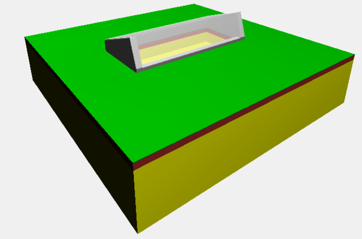

## About

ThreeJS scene viewer to visualize the walipini 3D model

[](http://github.com/badges/stability-badges)

## Installation

Run the install command:

```bash
    npm install walipini-viewer
```


## Build

To create the dist package, run either:

```bash
    npm run browserify
```

or

```bash
    npm run watch
```

## Start

Start a local web server in the dist folder

```bash
    cd dist
    $ http-server 
    Starting up http-server, serving ./
    Available on:
      http://127.0.0.1:8080
      http://192.168.1.69:8080
      http://192.168.1.68:8080
    Hit CTRL-C to stop the server
```

Open the web page with a browser from your localhost.

You should see something like this:



---

This project was generated by the
[kickoff](https://github.com/tombenke/kickoff) utility.
